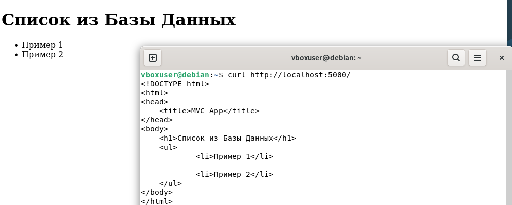

### Шаг 1
*Добавьте в код* `Dockerfile` *, который позволит запустить web-приложение с исходным кодом в каталоге* `app/` *через docker.*

Чтобы работать с `docker` добавим `Dockerfile`:
```dockerfile
FROM python

WORKDIR /app

RUN apt-get update && apt-get install -y build-essential 

COPY . .

RUN pip install --no-cache-dir -r app/requirements.txt

EXPOSE 5000
CMD ["python", "app/app.py"]
```

### Шаг 2
*Выполните запуск контейнера с этим приложением.*

Собираем контейнер командой:

```sh
sudo docker build . -t hw1
```

<details>
<summary>Вывод</summary>

```sh
[+] Building 9.2s (10/10) FINISHED                               docker:default
 => [internal] load build definition from Dockerfile                       0.0s
 => => transferring dockerfile: 190B                                       0.0s
 => [internal] load metadata for docker.io/library/python:latest           0.9s
 => [internal] load .dockerignore                                          0.0s
 => => transferring context: 2B                                            0.0s
 => [1/5] FROM docker.io/library/python:latest@sha256:89a288a9a9e9141b9f0  0.0s
 => => resolve docker.io/library/python:latest@sha256:89a288a9a9e9141b9f0  0.0s
 => [internal] load build context                                          0.0s
 => => transferring context: 6.66kB                                        0.0s
 => CACHED [2/5] WORKDIR /app                                              0.0s
 => CACHED [3/5] RUN apt-get update && apt-get install -y build-essential  0.0s
 => [4/5] COPY . .                                                         0.0s
 => [5/5] RUN pip install --no-cache-dir -r app/requirements.txt           5.3s
 => exporting to image                                                     2.8s 
 => => exporting layers                                                    2.3s 
 => => exporting manifest sha256:d7ba8030ac0796de64d64210a0f392370c292147  0.0s 
 => => exporting config sha256:0c6b3b42e85484866bd8e21a807160b1ba64dec755  0.0s 
 => => exporting attestation manifest sha256:e9047786885fc0a3c08bacb10f8f  0.0s 
 => => exporting manifest list sha256:a65b0e0a36dc10253a346404ede7089bde2  0.0s 
 => => naming to docker.io/library/hw1:latest                            0.0s
 => => unpacking to docker.io/library/hw1:latest                         0.4s
```
</details>

Запускаем при помощи команды
```sh
sudo docker run -d --name app hw1 tail -f /dev/null
```
Флаги нужны для того, чтобы работа контейнера резко не прерывалась. Команда выводит айди контейнера:
```sh
b45767438242dd4368dfc9af66ce84bf79975a2124cee467ea3683f730c13c3e
```
### Шаг 3
*Скопируйте из консоли в каталог* `/home/` *контейнера файл `README.md`.*
Копируем при помощи команды
```sh
sudo docker cp README.md app:/home/
```


Вывод:

```sh
Successfully copied 4.44kB (transferred 6.14kB) to app:/home/
```

### Шаг 4
*Подключитесь к терминалу контейнера с приложением в интерактивном режиме. Проверьте, что скопированный файл находится в нужном каталоге.*
Включаем интерактивный режим с помощью команды:
```sh
sudo docker exec -it app /bin/bash
```

После чего проверяем наличие файла `README.md`, затем выходим из интерактивного режима сочетанием клавиш Ctrl + Q.
```sh
root@b45767438242:/app# ls /home
README.md
```

### Шаг 5
*Выйдите из интерактивного режима.*
Выходим из интерактивного режима сочетанием клавиш Ctrl + Q. Вывод:

```sh
root@b45767438242:/app# read escape sequence
```

### Шаг 6
*Остановите котейнер с приложением.*
```sh
sudo docker stop app
```

## Часть 2. Docker compose
### Шаг 1
*Создайте файл `docker-compose.yml` таким образом, чтобы совместно с описанным в части 1 контейнером работала бы база данных mysql. Файл инициализации БД в каталоге `db/init.sql`. Также пропишите порт подключения к приложению.*

Файл выглядит следующим образом:
```yaml
services:
  web:
    build: .
    container_name: py_backend
    ports:
      - "5000:5000"
    depends_on:
      db:
        condition: service_healthy
    environment:
      DB_PASSWORD: ${DB_PASSWORD}
      DB_HOST: ${DB_HOST}
      DB_NAME: ${DB_NAME}
      DB_USER: ${DB_USER}
    env_file:
      - .env

  db:
    image: mysql:8.0
    container_name: homework_db
    restart: always
    command: --character-set-server=utf8mb4 --collation-server=utf8mb4_unicode_ci
    environment:
      MYSQL_ROOT_PASSWORD: ${DB_ROOT_PASSWORD}
      MYSQL_DATABASE: ${DB_NAME}
      MYSQL_USER: ${DB_USER}
      MYSQL_PASSWORD: ${DB_PASSWORD}
    env_file:
      - .env
    ports:
      - "3306:3306"
    volumes:
      - db_data:/var/lib/mysql
      - ./db:/docker-entrypoint-initdb.d
    healthcheck:
      test: ["CMD", "mysqladmin", "ping", "-h", "localhost", "-u", "root", "-p${DB_ROOT_PASSWORD}"]
      interval: 10s
      timeout: 5s
      retries: 5

volumes:
  db_data:
```
Переменные для базы данных поместим в файл `.env` и добавим его в `.gitignore`.

### Шаг 2
*Запустите связку web-приложение - БД.*

Перед каждым запуском нужно очистить все файлы БД с помощью команды
```
sudo docker compose down -v
```
Запуск выполняется командой 
```
sudo docker compose up --build
```

<details>

<summary>Вывод</summary>

```sh
[+] down 4/4
 ✔ Container py_backend  Removed                                            0.0s
 ✔ Container homework_db Removed                                            0.0s
 ✔ Volume lab07_db_data  Removed                                            0.0s
 ✔ Network lab07_default Removed                                            0.2s
vboxuser@debian:~/lab07$ sudo docker compose up --build
[+] Building 10.0s (12/12) FINISHED                                             
 => [internal] load local bake definitions                                 0.0s
 => => reading from stdin 476B                                             0.0s
 => [internal] load build definition from Dockerfile                       0.0s
 => => transferring dockerfile: 232B                                       0.0s
 => [internal] load metadata for docker.io/library/python:latest           1.0s
 => [internal] load .dockerignore                                          0.0s
 => => transferring context: 2B                                            0.0s
 => [1/5] FROM docker.io/library/python:latest@sha256:89a288a9a9e9141b9f0  0.0s
 => => resolve docker.io/library/python:latest@sha256:89a288a9a9e9141b9f0  0.0s
 => [internal] load build context                                          0.0s
 => => transferring context: 660B                                          0.0s
 => CACHED [2/5] WORKDIR /app                                              0.0s
 => CACHED [3/5] RUN apt-get update && apt-get install -y build-essential  0.0s
 => [4/5] COPY . .                                                         0.0s
 => [5/5] RUN pip install --no-cache-dir -r app/requirements.txt           5.8s
 => exporting to image                                                     2.9s 
 => => exporting layers                                                    2.4s 
 => => exporting manifest sha256:476336a62d5da825a095d33d1d2cef50d7f9bb9e  0.0s 
 => => exporting config sha256:834b05967fedc636816a1ff9b6efa2a63d559c5591  0.0s 
 => => exporting attestation manifest sha256:5cdfad51fda6c3968601fdfb1cdf  0.0s 
 => => exporting manifest list sha256:bf3eaa90b4a086baf6504d387aa2425be3d  0.0s 
 => => naming to docker.io/library/lab07-web:latest                        0.0s
 => => unpacking to docker.io/library/lab07-web:latest                     0.4s
 => resolving provenance for metadata file                                 0.0s
[+] up 5/5
 ✔ Image lab07-web       Built                                             10.1s
 ✔ Network lab07_default Created                                            0.0s
 ✔ Volume lab07_db_data  Created                                            0.0s
 ✔ Container homework_db Created                                            0.2s
 ✔ Container py_backend  Created                                            0.0s
Attaching to homework_db, py_backend
Container homework_db Waiting 
homework_db  | 2026-05-15 16:30:42+00:00 [Note] [Entrypoint]: Entrypoint script for MySQL Server 8.0.46-1.el9 started.
homework_db  | 2026-05-15 16:30:42+00:00 [Note] [Entrypoint]: Switching to dedicated user 'mysql'
homework_db  | 2026-05-15 16:30:42+00:00 [Note] [Entrypoint]: Entrypoint script for MySQL Server 8.0.46-1.el9 started.
homework_db  | 2026-05-15 16:30:42+00:00 [Note] [Entrypoint]: Initializing database files
homework_db  | 2026-05-15T16:30:42.605575Z 0 [Warning] [MY-011068] [Server] The syntax '--skip-host-cache' is deprecated and will be removed in a future release. Please use SET GLOBAL host_cache_size=0 instead.
homework_db  | 2026-05-15T16:30:42.605648Z 0 [System] [MY-013169] [Server] /usr/sbin/mysqld (mysqld 8.0.46) initializing of server in progress as process 79
homework_db  | 2026-05-15T16:30:42.612165Z 1 [System] [MY-013576] [InnoDB] InnoDB initialization has started.
homework_db  | 2026-05-15T16:30:43.039397Z 1 [System] [MY-013577] [InnoDB] InnoDB initialization has ended.
homework_db  | 2026-05-15T16:30:43.925935Z 6 [Warning] [MY-010453] [Server] root@localhost is created with an empty password ! Please consider switching off the --initialize-insecure option.
homework_db  | 2026-05-15 16:30:46+00:00 [Note] [Entrypoint]: Database files initialized
homework_db  | 2026-05-15 16:30:46+00:00 [Note] [Entrypoint]: Starting temporary server
homework_db  | 2026-05-15T16:30:47.075218Z 0 [Warning] [MY-011068] [Server] The syntax '--skip-host-cache' is deprecated and will be removed in a future release. Please use SET GLOBAL host_cache_size=0 instead.
homework_db  | 2026-05-15T16:30:47.076449Z 0 [System] [MY-010116] [Server] /usr/sbin/mysqld (mysqld 8.0.46) starting as process 122
homework_db  | 2026-05-15T16:30:47.088454Z 1 [System] [MY-013576] [InnoDB] InnoDB initialization has started.
homework_db  | 2026-05-15T16:30:47.246452Z 1 [System] [MY-013577] [InnoDB] InnoDB initialization has ended.
homework_db  | 2026-05-15T16:30:47.409605Z 0 [Warning] [MY-010068] [Server] CA certificate ca.pem is self signed.
homework_db  | 2026-05-15T16:30:47.409633Z 0 [System] [MY-013602] [Server] Channel mysql_main configured to support TLS. Encrypted connections are now supported for this channel.
homework_db  | 2026-05-15T16:30:47.413338Z 0 [Warning] [MY-011810] [Server] Insecure configuration for --pid-file: Location '/var/run/mysqld' in the path is accessible to all OS users. Consider choosing a different directory.
homework_db  | 2026-05-15T16:30:47.429104Z 0 [System] [MY-011323] [Server] X Plugin ready for connections. Socket: /var/run/mysqld/mysqlx.sock
homework_db  | 2026-05-15T16:30:47.429244Z 0 [System] [MY-010931] [Server] /usr/sbin/mysqld: ready for connections. Version: '8.0.46'  socket: '/var/run/mysqld/mysqld.sock'  port: 0  MySQL Community Server - GPL.
homework_db  | 2026-05-15 16:30:47+00:00 [Note] [Entrypoint]: Temporary server started.
homework_db  | '/var/lib/mysql/mysql.sock' -> '/var/run/mysqld/mysqld.sock'
homework_db  | Warning: Unable to load '/usr/share/zoneinfo/iso3166.tab' as time zone. Skipping it.
homework_db  | Warning: Unable to load '/usr/share/zoneinfo/leap-seconds.list' as time zone. Skipping it.
homework_db  | Warning: Unable to load '/usr/share/zoneinfo/leapseconds' as time zone. Skipping it.
homework_db  | Warning: Unable to load '/usr/share/zoneinfo/tzdata.zi' as time zone. Skipping it.
homework_db  | Warning: Unable to load '/usr/share/zoneinfo/zone.tab' as time zone. Skipping it.
homework_db  | Warning: Unable to load '/usr/share/zoneinfo/zone1970.tab' as time zone. Skipping it.
homework_db  | 2026-05-15 16:30:48+00:00 [Note] [Entrypoint]: Creating database db
homework_db  | 2026-05-15 16:30:48+00:00 [Note] [Entrypoint]: Creating user myuser
homework_db  | 2026-05-15 16:30:48+00:00 [Note] [Entrypoint]: Giving user myuser access to schema db
homework_db  | 
homework_db  | 2026-05-15 16:30:49+00:00 [Note] [Entrypoint]: /usr/local/bin/docker-entrypoint.sh: running /docker-entrypoint-initdb.d/init.sql
homework_db  | 
homework_db  | 
homework_db  | 2026-05-15 16:30:49+00:00 [Note] [Entrypoint]: Stopping temporary server
homework_db  | 2026-05-15T16:30:49.051865Z 14 [System] [MY-013172] [Server] Received SHUTDOWN from user root. Shutting down mysqld (Version: 8.0.46).
homework_db  | 2026-05-15T16:30:50.236743Z 0 [System] [MY-010910] [Server] /usr/sbin/mysqld: Shutdown complete (mysqld 8.0.46)  MySQL Community Server - GPL.
homework_db  | 2026-05-15 16:30:51+00:00 [Note] [Entrypoint]: Temporary server stopped
homework_db  | 
homework_db  | 2026-05-15 16:30:51+00:00 [Note] [Entrypoint]: MySQL init process done. Ready for start up.
homework_db  | 
homework_db  | 2026-05-15T16:30:51.260222Z 0 [Warning] [MY-011068] [Server] The syntax '--skip-host-cache' is deprecated and will be removed in a future release. Please use SET GLOBAL host_cache_size=0 instead.
homework_db  | 2026-05-15T16:30:51.261033Z 0 [System] [MY-010116] [Server] /usr/sbin/mysqld (mysqld 8.0.46) starting as process 1
homework_db  | 2026-05-15T16:30:51.266165Z 1 [System] [MY-013576] [InnoDB] InnoDB initialization has started.
homework_db  | 2026-05-15T16:30:51.426172Z 1 [System] [MY-013577] [InnoDB] InnoDB initialization has ended.
homework_db  | 2026-05-15T16:30:51.602065Z 0 [Warning] [MY-010068] [Server] CA certificate ca.pem is self signed.
homework_db  | 2026-05-15T16:30:51.602095Z 0 [System] [MY-013602] [Server] Channel mysql_main configured to support TLS. Encrypted connections are now supported for this channel.
homework_db  | 2026-05-15T16:30:51.604818Z 0 [Warning] [MY-011810] [Server] Insecure configuration for --pid-file: Location '/var/run/mysqld' in the path is accessible to all OS users. Consider choosing a different directory.
homework_db  | 2026-05-15T16:30:51.621070Z 0 [System] [MY-011323] [Server] X Plugin ready for connections. Bind-address: '::' port: 33060, socket: /var/run/mysqld/mysqlx.sock
homework_db  | 2026-05-15T16:30:51.621126Z 0 [System] [MY-010931] [Server] /usr/sbin/mysqld: ready for connections. Version: '8.0.46'  socket: '/var/run/mysqld/mysqld.sock'  port: 3306  MySQL Community Server - GPL.
Container homework_db Healthy 
py_backend   |  * Tip: There are .env files present. Install python-dotenv to use them.
py_backend   |  * Serving Flask app 'app'
py_backend   |  * Debug mode: off
py_backend   | WARNING: This is a development server. Do not use it in a production deployment. Use a production WSGI server instead.
py_backend   |  * Running on all addresses (0.0.0.0)
py_backend   |  * Running on http://127.0.0.1:5000
py_backend   |  * Running on http://172.18.0.3:5000
py_backend   | Press CTRL+C to quit
```

</details>

### Шаги 3 и 4
*Проверьте подключение к приложению*

Пишем `http://localhost:5000` в браузере, после чего пишем в терминале `curl`




Все работает нормально
